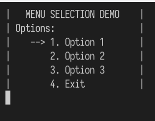
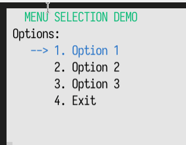

# 简介
## v1
控制台菜单是不少刚开始学编程的人都要面临的问题，最后大部分都是这样子的，大体上都一个[模子](https://www.w3cschool.cn/java/codedemo-484048230.html)，这里将 ta 称之为 v1。 首先输出菜单项和其对应的编号，然后用户输入编号进行操作。其实这是有进一步提升的空间的。
```cpp
// file： v1.c
  printf("|   MENU SELECTION DEMO    |\n");
  printf("| Options:                 |\n");
  printf("|        1. Option 1       |\n");
  printf("|        2. Option 2       |\n");
  printf("|        3. Option 3       |\n");
  printf("|        4. Exit           |\n");
  printf("Select option: ");
```

之前编译过 Linux 内核，ta 的菜单也是在控制台里的，之后在[ESP - IDF](../espidf)中也看到了类似的菜单，两者大体上和 BIOS 操作逻辑差不多，比 v1 多了啥呢？这里将这个类型归类为 v2

## v2
使用一下就会发现，v2 比 v1 多出的点：
- 键盘上下键选择菜单项，回车确认，无需输入对应的菜单项编号
- 支持多个功能键： 如 F10
- 带多种颜色
- 带长宽自适应




### [getch](getch-linux.c)
无论是键盘上下还是其它功能键，都要获取键盘的输入，并且不需要像之前那样需要显示出来。要使用 system() 的时候，需要引入 <stdlib.h> ，不然就会报错提示 C99 标准不允许隐试调用，采用 C89 编译也不是好办法。

- [在linux中使用getch()函数. EmbededCoder 2019-05-13](https://blog.csdn.net/u012308586/article/details/90169314):使用 curses 替代 conio，获取和输出都有些问题
  ```bash
  // 输出会多了一些空格，每输出一次就会多将近20个空格，比如 上键
  ^[You input is: 7
                  [You input is: [-91
                                      AYou input is: A-65
  ```
- [ linux下解决conio.h的问题. 2016-11-17 18:53  future_liu](https://www.cnblogs.com/future-liu1121/p/6075023.html):虽然不显示，使用的还是 getchar,需要回车才算输入
  > linux中stty -echo是不显示输入内容的意思
- [C语言中怎么使用户不用按回车键，输入字符后就直接调用函数.小-豪-豪 2020-01-17](https://blog.csdn.net/qq_39014877/article/details/104010727):这个使用getchar,但是不用回车，但是会显示，这个可以使用 clear 解决
  > system("stty -icanon");//关闭缓冲区，输入字符无需按回车键直接接受
- [stty 命令说明及使用讲解. Alan0521 2012-05-20](https://blog.csdn.net/alan0521/article/details/7584932)
  > icanon	启用规范输入（规范输入允许使用 ERASE 和 KILL 字符进行输入行的编辑）。  
  -icanon	禁用规范输入。

### [getchar](getchar.c)
为了探究为什么 [getch-linux](getch-linux.c) 中方向键、回车键等获取的值是多个而且均与 [getch-win](getch-win.c)中的不同，用[getchar](getchar.c)试了一下发现方向键输入的时候真的是一次输入了三个字符，而且其中前两个是一样的，第三个则和大写字母一样。。。也就是说用这两函数分辨这几个按键有点头大。

从输出中还可以得到的结果有 getchar 连回车的值也获取到了，这也印证了每个输出都会莫名其妙多出了
  ```c
  You input is:
  <-> 10
  ```

### VT 控制码
- `\033[B;Fm`： B-背景色，F-前景色
  背景颜色: 40:黑，41:深红，42:绿，43:黄色，44:蓝色，45:紫色，46:深绿，47:白色
  前景色（字体颜色）：30:黑，31:红，32:绿，33:黄，34:蓝色，35:紫色，36:深绿，37:白色

### 程序
目前代码都是在 Linux 平台试验通过，暂时不兼容 Windows 平台
- [v2-1](v2-1.c):现在知道了获取输入不用回车的办法，就可以写一个上下选择的菜单了
- [v2-2](v2-2.c)：给菜单加上颜色
  - [VT控制码. Engineer-Bruce_Yang 2016-02-21](https://blog.csdn.net/morixinguan/article/details/50710083)：很好的解释，但是看了不会用
  - [linux下控制台颜色输出. HES_C 2017-05-11](https://blog.csdn.net/HES_C/article/details/71600471):给出了一个 printf 案例，一下子就知道咋用了
- [v2-3](v2-3.c)：加上自适应居中
- [v2-1-1](v2-1-1.c)：对 v2-1.c 进行函数封装
- [v2-2-1](v2-2-1.c)：对 v2-2.c 进行函数封装
- [v2](v2.c):对 v2-3.c 进行函数封装，方便快速复用

# 参考
- [C语言实现一个Window控制台带彩色，且可以用方向键选择并确认的菜单式列表(一)Engineer-Bruce_Yang 2017-08-22](https://yangyuanxin.blog.csdn.net/article/details/77485367)：这就是我想要的效果，看起来极像 GUI,但实际不是， IDF 中也有类似的菜单
  > 比如Linux内核中的Make menuconfig。
  我们可以看到像下面这样的GUI菜单式界面，这样的界面用Linux VT100控制码结合C语言是很容易就可以实现出来的。
- [Shang / SimpleMenu ](https://gitee.com/shangcode_happy/SimpleMenu)：无预览，无说明，无法鉴别效果
  > 用C语言写的一个运行在Windows控制台内的菜单。
- [拜托不要再用system("pause")和void main了. stereoMatching. 2012-10-01](https://bbs.csdn.net/topics/390231844)：一个 getchar() 可能不行，那就来两个
  > 不要用system("pause")来暂停，可以改用std::cin.get或getchar()